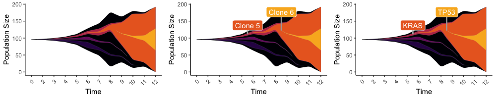

# EvoFreq
Visualization Package for Evolutionary Dynamics from Sequence and Model Data.

## Installation

```R
install.packages('devtools')
library(devtools)
install_github('MathOnco/EvoFreq')
```

## Using EvoFreq

EvoFreq has two primary functions: `get_evofreq()` and the final rendering of these frequencies using `plot_evofreq()`. To quckly see all the functions within EvoFreq use `help(package="EvoFreq")`. The quickest way to see an EvoFreq plot is to use:
```R
library(EvoFreq)

data("example.easy.wide") # load example data

freq_frame <- get_evofreq(example.easy.wide[,seq(3,10)], example.easy.wide$clones, example.easy.wide$parents, clone_cmap = "magma") # Get freq_frame, a properly structured data.frame

evo_freq_p <- plot_evofreq(freq_frame) # Get an EvoFreq plot
```

Below you will find more useful tools, information, and features.

### Flexibility in data formats

A goal of EvoFreq was to increase the flexibility in the input data. To this end we employ functions to use both long and wide dataframes.

#### Wide Format Data
```R
# Note: this can be copy and pasted after installed

data("example.easy.wide") # Load a simple Data Frame example
str(example.easy.wide) # Inspect the data structure

# 'data.frame':	8 obs. of  10 variables:
#  $ parents: num  0 1 1 3 1 5 5 5
#  $ clones : num  1 2 3 4 5 6 7 8
#  $ 1      : num  1 0 0 0 0 0 0 0
#  $ 2      : num  100 5 0 0 0 0 0 0
#  $ 3      : num  200 100 5 0 0 0 0 0
#  $ 4      : num  400 5 100 1 1 0 0 0
#  $ 5      : num  0 0 200 100 100 1 0 1
#  $ 6      : num  0 0 200 125 200 10 1 15
#  $ 7      : num  0 0 300 200 300 20 10 25
#  $ 8      : num  0 0 300 300 300 25 25 100

# You have A column of parents and a column of clones then you have a column for each of the timepoints with sizes for that clone.

# Then get the frequency data. (Use ?get_evofreq for options)
freq_frame <- get_evofreq(example.easy.wide[,seq(3,10)], example.easy.wide$clones, example.easy.wide$parents, clone_cmap = "magma")

# Create the plot (shown on the left below)
evo_freq_p <- plot_evofreq(freq_frame)
print(evo_freq_p)

# We can also choose to update the colors or do this during the first creation. (shown on the right below)
clone_dynamics_df_jet <- update_colors(freq_frame, clone_cmap = "jet")
evo_freq_p_jet <- plot_evofreq(clone_dynamics_df_jet)
print(evo_freq_p_jet)
```


#### Long Format Data
```R
# Note: this can be copy and pasted after installed

# In this example you have two files. One is the edge list of clones and their parents
# The other file is the sizes over time for those clones
# examine the structures to see how to format
# example.easy.long.edges now has an attribute column as well
data("example.easy.long.edges")
data("example.easy.long.sizes")

# Use the long_to_wide_size_df function to get the right data structure.
wide_df <- long_to_wide_freq_ready(long_pop_sizes_df = example.easy.long.sizes, time_col_name = "Time", clone_col_name = "clone", parent_col_name = "parent", size_col_name = "Size", edges_df = example.easy.long.edges)
clones <- wide_df$clones
parents <- wide_df$parents
size_df <- wide_df$wide_size_df

freq_frame <- get_evofreq(size_df, clones, parents, clone_cmap = "inferno")
evo_freq_p <- plot_evofreq(freq_frame)
evo_freq_p

# Add custom ggplot features
evo_freq_labeled_p <- get_evofreq_labels(freq_frame, clone_list=c(5,6), extant_only=F, evofreq_plot = evo_freq_p, apply_labels=T)
evo_freq_labeled_p

# Add custom labels instead of defaults
evo_freq_labeled_p_custom <- get_evofreq_labels(freq_frame, clone_list=c(5,6), custom_label_text = c("KRAS","TP53"), extant_only=F, evofreq_plot = evo_freq_p, apply_labels=T)
evo_freq_labeled_p_custom

library(gridExtra)
grid.arrange(evo_freq_p,evo_freq_labeled_p,evo_freq_labeled_p_custom, nrow=1)
```


## Visualizing outputs from Subclonal Reconstruction tools

EvoFreq has necessary functions for visualizing [PhyloWGS](https://github.com/morrislab/phylowgs) and [CALDER](https://github.com/raphael-group/calder) outputs. Similar to other tools, [CloneEvol](https://github.com/hdng/clonevol) outputs are already compatible.

```R
# PhyloWGS
phylowgs_output="run_name.summ.json"

# Return one or all using parsing options. Use "?parse_phylowgs" for help
tree_data <- parse_phylowgs(json_file=phylowgs_output)

#EvoFreqPlots
pdf('./evofreqs.pdf', width=8, height=4, onefile = T)
for (i in 1:length(f$all)){
  clone_dynamics_df <- get_evofreq(tree_data[[i]][,c(5,length(colnames(tree_data)))], clones=tree_data[[i]]$clone, parents=tree_data[[i]]$parent, clone_cmap = "jet")
  p <- plot_evofreq(evofreq_df)
  print(p)
}
dev.off()

# CALDER
theFile <- "SA501_tree1.dot"
theSoln <- "SA501_soln1.csv"
calder.data <- parse_calder(theSoln, theFile)

### Use the long_to_wide_size_df function to get the right data structure.
wide_df <- long_to_wide_size_df(long_pop_sizes_df = calder.data$sizeDf,
                                edges_df = calder.data$edges,
                                time_col_name = "time",
                                clone_col_name = "clone",
                               parent_col_name = "parent",
                                size_col_name = "size",
                                fill_gaps_in_size = T
)
clones <- as.character(wide_df$clones)
parents <- as.character(wide_df$parents)
size_df <- wide_df$wide_size_df

clone_dynamics_df <- get_evofreq(size_df, clones, parents, clone_cmap = "jet", data_type = "size", threshold=0, test_links = T, add_origin = T, interp_method = "bezier")
plot_evofreq(clone_dynamics_df)
```

## Features

One of the most powerful features is the endless additions that can be added to each plot. Any ggplot2 function can be added to the frequency dynamics plots.

## Extended functionality

For a full list of the different functions and example datasets please use `help(package="EvoFreq")`.

## Dependencies

Most of the features for EvoFreq don't require special packages. Most of the packages that are required are easily installed. On top of some of the standard libraries `magick` is required for animations. For mac users this requires `ffmpeg` that can be installed via [macports](https://www.macports.org) like so:
```bash
sudo port install ffmpeg
```
Otherwise, EvoFreq will require ggplot2, colormap, reshape2, ggraph, ggforce, igraph, tidygraph, magick, intergraph, sna, GGally, and ape.

## Current Papers utilizing EvoFreq

These papers have used EvoFreq for their publication ready images.

- Chandler D. Gatenbee, Ann-Marie Baker, Ryan O. Schenck, Margarida P. Neves, Sara Yakub Hasan, Pierre Martinez, William CH Cross, Marnix Jansen, Manuel Rodriguez-Justo, Andrea Sottoriva, Simon Leedham, Mark Robertson-Tessi, Trevor A. Graham, Alexander R.A. Anderson. [Niche engineering drives early passage through an immune bottleneck in progression to colorectal cancer](https://www.biorxiv.org/content/10.1101/623959v2). 2019. bioRxiv.
- Ryan O Schenck, Eunung Kim, Rafael Bravo, Jeffrey West, Simon Leedham, Darryl Shibata, Alexander R.A. Anderson. [Clonal Architecture of the Epidermis: Homeostasis Limits Keratinocyte Evolution](https://www.biorxiv.org/content/10.1101/548131v1). 2019. bioRxiv.
- Jeffrey West, Ryan Schenck, Chandler Gatenbee, Mark Robertson-Tessi, Alexander RA Anderson. [Tissue structure accelerates evolution: premalignant sweeps precede neutral expansion](https://www.biorxiv.org/content/10.1101/542019v1). 2019. bioRxiv.
- Jeffrey West, Li You, Joel Brown, Paul K. Newton, Alexander R. A. Anderson. [Towards multi-drug adaptive therapy](https://www.biorxiv.org/content/10.1101/476507v4). 2019. bioRxiv.
